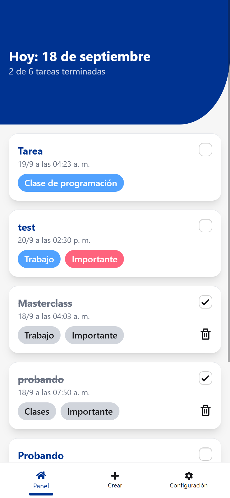
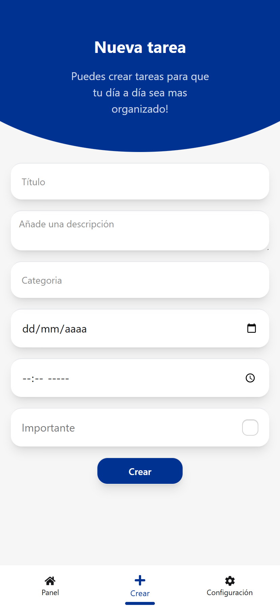

<h1 align="center">Todo App - ⚛ React + 🗡 TypeScript + ⚡ Vite</h1>

⚙ **Estado:** En desarrollo...

Esta aplicación tiene como objetivo practicar y repasar conocimientos. En esta ocasión decidí usar TypeScript, ya que es una tecnología en la que aún tengo áreas por mejorar.

## 📷 Capturas de pantallas

<div style="display:flex; flex-direction:row;">
    
    
</div>


## 🧩 Características principales

Puedes crear **Todos** con fecha, hora, categoría, descripción, título y marcar su nivel de importancia.

👀 *Algunas de estas características aún están en desarrollo, por lo que puede que no se reflejen en la versión actual de la página DEMO. De hecho solo tengo la vista mobil mientras tanto...*

### Páginas
* **Inicio:** Visualiza tus todos, márcalos como completados y elimínalos.
* **Crear:** Crea nuevos todos con todos los campos mencionados anteriormente.
* **Configuración:** Cambia el tema de la aplicación y cierra sesión.

## 🚀 Demo
[Ver demo en vivo con GitHub Pages.](https://enmanuel-ve.github.io/Todo-App/)

## ⚙ Tecnologías usadas
* 🌐 **Lenguajes:** TypeScript, HTML, CSS. 
* ⚛ **Framework / Librerías:** TailwindCSS, daisyUI, ReactJS, React Router DOM, React Hook Form, React Icons. 
* 🧰 **Herramientas:** Vite, pnpm, VS Code. 
* 🖥 **BaaS:** Supabase.

## 📦 Instalación.
🔥 Para correr el proyecto localmente, sigue los siguientes pasos:

1. Clona el repositorio: 
```bash
    git clone https://github.com/Enmanuel-VE/Todo-App.git
```

2. Navega al directorio del proyecto: 
```bash
    cd todo-app
```

3. Instala las dependencias: 
```bash
    pnpm install
```

## 👉 Conectate conmigo.
* **LinkedIn:** [Enmanuel Antoni Bracho Villanueva](https://www.linkedin.com/in/enmanuel-antoni-bracho-villanueva/)
* **Correo Electrónico:** [enmanuelbracho.dev@gmail.com](mailto:enmanuelbracho.dev@gmail.com)

---


<footer align="center"> Hecho con 💜 </footer>
